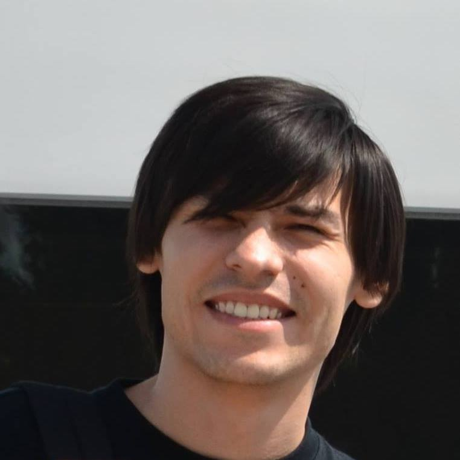
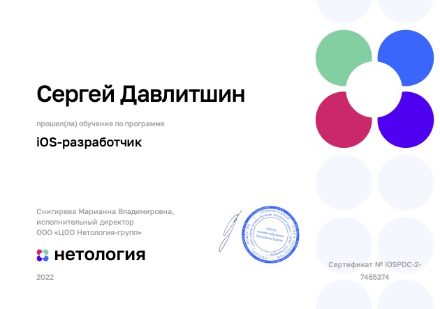

# Curriculum Vitae
### Sergey Davlitshin
***independent iOS developer***  
 
  

Hi there! My name is Sergey. I am developing apps for iOS, but in the near future I would like to make apps also for macOS, watchOS and tvOS as well.

### Here is the list of skills that I want to have as an iOS developer:
* [x] Swift
* [x] UIKit
* [ ] SwiftUI
* [x] Version control (Git)
* [ ] Working with data
* [ ] Networking
* [ ] Multithreading
* [ ] Core Data
* [ ] Testing
* [ ] Software architecture

### My projets:
Coming very soon...

### My certificates:

### Contacts
> Email: sergey.davlitshin@gmail.com  
> Telegram: @SeryozhaSparky
